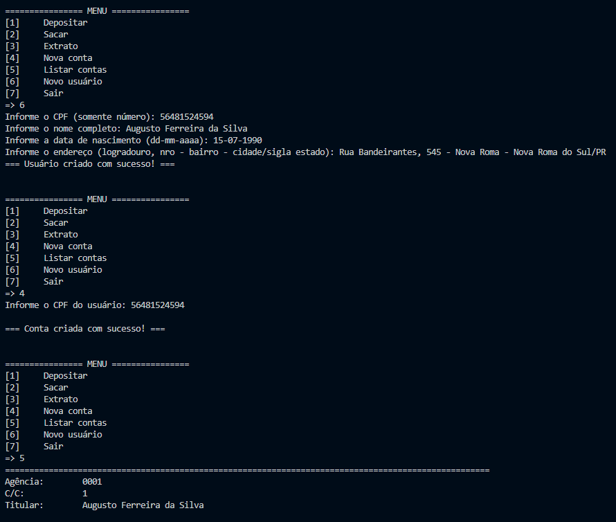
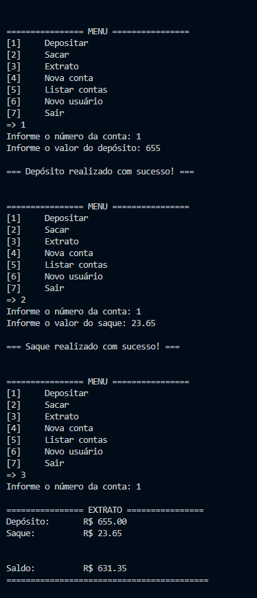

  
🏦 Banking System

This is a terminal-based banking system developed in Python, focusing on the application of Object-Oriented Programming (OOP) concepts.

 

🎯 Project Purpose

 

The goal of this project is to practice structuring classes and methods in Python by simulating a banking system with the following features:

    👤 User creation

    🏦 Bank account creation for each user

    💸 Deposits and withdrawals

    📄 Bank statement generation

 

🖼️ Project Images

 

 

💻 Technology Used

 

    🐍 Python — Language used in the project

 

▶️ How to Run

 

    Clone this repository:

Bash

git clone https://github.com/BrunOliveiraCA/banking_system.git

    Navigate to the project folder:

Bash

cd banking_system

    Run the main script:

Bash

python main.py

 

🧠 Key Learnings

 

This project was essential for:

    Consolidating OOP concepts in Python.

    Practicing in-memory data manipulation.

    Creating a simple command-line interface (CLI).

    Simulating business rules, such as withdrawal limits and balance control.

 

📄 License

 

This project is licensed under the MIT License. See the LICENSE file for more information.
